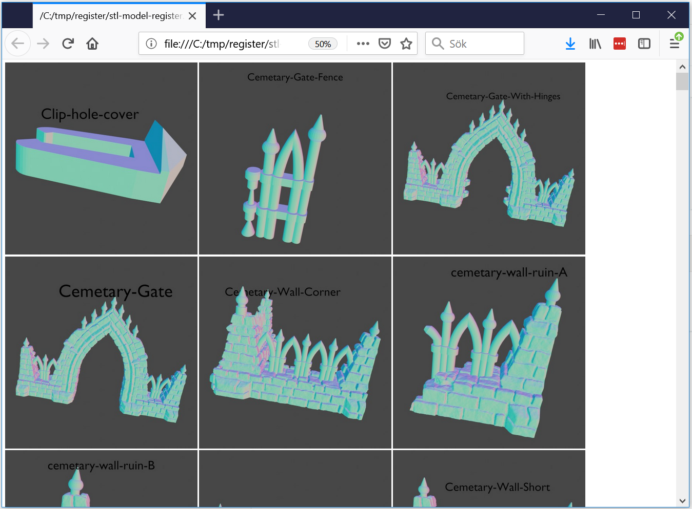

# stl-librarian
Generate a register with images of all stl-files in a folder. Two images for each model will be rendered. One is a still, including the name of the file. The other is an animated gif showing a rotating model. An html-file will be created with image tags for all images.
When hovering over an image, it will show the animated gif, otherwise the still.

## OS Support

This script will work on your system if you can get Blender 2.8 to run.

### Install PIL/Pillow

PIL/Pillow is used to save the animated gif. Install it using pip if it is not installed:

/path/to/blenders/python -m pip install pillow

## Usage

1. Download the blend-file from latest release. Python script is already loaded.
1. Open the blend-file in blender 2.8.
1. You should see a text file at the bottom. Edit the path at the top of the file.
1. source_dir should point to the directory where your STL-files are stored
1. target_dir should point to an existing directory where the images and html-file will be stored, a temp-dir is suggested
1. Enable "System console" in the System menu. 
1. Click run script
1. Wait, this will take some time. Monitor the progress in the console.
1. Inspect the result in the target dir.

### Non-mandatory properties

You can alter the size of the rendered images using width and height.

For the animation, there are three properties to change. 
 * anim_frames determine how many frames will be rendered. A whole turn will be generated (unless the number of frames are very low). More frames will make the animation play more smoothly but will also take up more space and take longer to render.
 * anim_seconds determine how long the animation will be. A delay for each frame will be calculated based on this value.
 * anim_scale determines how big the animation will be, in percent of the still image. A value of 50% will save a lot of space (and some render time).
 
The default value will give gif images of about 1 Mb.

### Windows paths

Even if you are using windows, you should use forward slashes "/". And remove the ":" after the drive letter.
So if your files are at C:\Users\Nisse\somefolder write it as: /C/Users/Nissse/somefolder

## Function

The blend file contains a camera and two materials. One material that mimics a matcap material is the the model rendered.
The other material is for the text label.

The python script in the repository is not really used. It is only there to see changes in it.

### For each stl-file

A stl-file is loaded and the matcap material is loaded. It's origin is set to the center of the object.

A text object is created and gets text content as the name of the model file. It also gets the text label material.
The text object has it's origin set to center and is then positioned above the model object. It's rotation is set to match the camera so that it will be visible.

The 3D diagonal of the model object and text label dimensions are compared and the label is scaled to match the model.

The camera gets a bit narrower FOV and is set to focus on the two selected objects (model and label). Then the original FOV is restored. This is a quick and easy zoom out.

The scene is rendered to an image with the name of the model loaded.

Name of model is saved to a list.

A series of frames is rendered where the camera rotates around the model. Pillow is used to save the gif.

Finally both the model object and label is deleted.

### Generate html-file

This is very simple. Loop over all the names of the models. Create a very simple html-file and add image tags for all models.

## Contribute

Feature requests, issues and Contributions are very welcome. I have no set roadmap right now but I see room for lots of improvements.

* Better placement of the label
* Generate a gif from a rotating model??? Perhaps to be shown on mouse over to not induce motion sickness.
* Analyze model normals and rotate it to expose maximum amount of detail.
* Some kind of lighted rendering.
* Some kind of Ambient occlusion in render.
* Write as proper plugin in blender?
